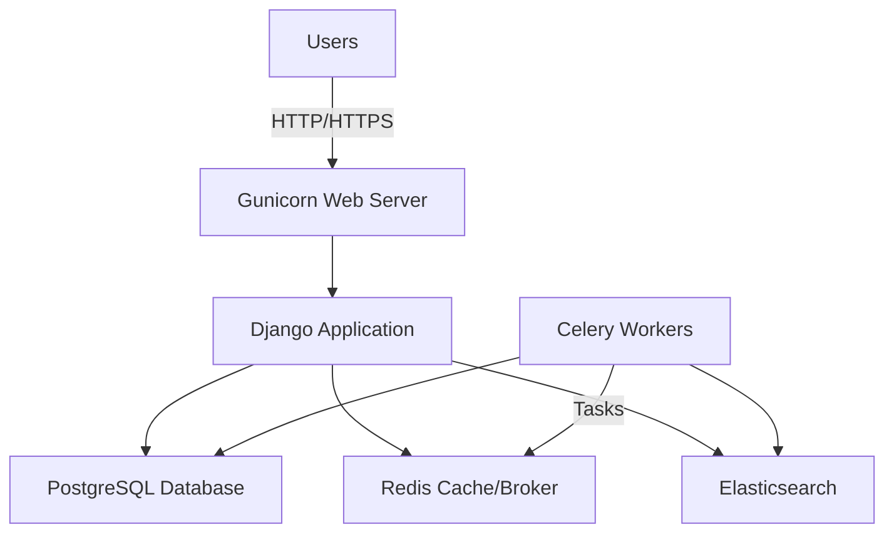

## System architecture

Kuma is built as a Django monolith with multiple specialized applications, designed to handle high-traffic documentation serving while supporting complex content management workflows.

### High-level design

The platform follows a traditional three-tier architecture:

1. **Presentation layer**: Gunicorn-served Django application with gevent workers
2. **Application layer**: Django apps handling business logic, APIs, and content management
3. **Data layer**: PostgreSQL database, Redis cache, and Elasticsearch search index



## Django application structure

Kuma is organized into focused Django apps, each handling specific platform functionality:

### Core applications

<AccordionGroup>
  <Accordion title="kuma.core - Core functionality">
    Foundation application providing shared utilities, base models, and common functionality used across all other apps. Includes session management and system health checks.
  </Accordion>
  
  <Accordion title="kuma.users - User management">
    Handles authentication and authorization using OAuth 2.0 with Firefox Accounts. Implements custom OIDC authentication backend (`KumaOIDCAuthenticationBackend`) and access token validation middleware.
    
    Key features:
    - OAuth integration with Firefox Accounts
    - Access token validation and refresh
    - User profile management
    - Admin superuser creation
  </Accordion>
  
  <Accordion title="kuma.api - REST APIs">
    Provides RESTful API endpoints for platform features. Includes endpoints for bookmarks, notifications, and user data. All API routes are prefixed with `@api` path.
  </Accordion>
  
  <Accordion title="kuma.attachments - File handling">
    Manages file uploads and attachments including code samples, demos, and media files. Integrates with AWS S3 for storage with CloudFront CDN delivery.
    
    Configuration:
    - Custom domain: `mdn.mozillademos.org`
    - Origin server: `demos-origin.mdn.mozit.cloud`
    - Storage: AWS S3 with configurable endpoint
  </Accordion>
  
  <Accordion title="kuma.bookmarks - Bookmarks system">
    Allows authenticated users to save and organize documentation pages. Integrates with the main MDN frontend at `developer.mozilla.org`.
    
    Settings:
    - Page size: 20 bookmarks per page (configurable via `API_V1_BOOKMARKS_PAGE_SIZE`)
    - Base URL configurable for local development
  </Accordion>
  
  <Accordion title="kuma.notifications - Notifications">
    Manages user notifications for content updates and platform events. Integrates with external notification service at `updates.developer.allizom.org`.
  </Accordion>
  
  <Accordion title="kuma.documenturls - URL management">
    Handles document URL routing and resolution. Manages the mapping between URL paths and documentation pages.
  </Accordion>
  
  <Accordion title="kuma.plus - MDN Plus features">
    Implements premium subscription features for MDN Plus subscribers. Includes enhanced collections and notification limits.
    
    Free tier limits:
    - 3 notifications for non-subscribers
    - 5 collections for non-subscribers
  </Accordion>
</AccordionGroup>

## Technology stack

### Backend technologies

<CardGroup cols={2}>
  <Card title="Django" icon="python">
    Python web framework providing ORM, routing, templating, and admin interface. Kuma uses Django's middleware stack for authentication, CSRF protection, and security.
  </Card>
  
  <Card title="PostgreSQL" icon="database">
    Primary relational database storing all platform data including users, documents, bookmarks, and notifications. Connection pooling via `CONN_MAX_AGE` setting.
  </Card>
  
  <Card title="Redis" icon="server">
    Serves dual purpose:
    - **Cache backend**: Stores frequently accessed data with 60-minute default timeout
    - **Message broker**: Queues Celery tasks for async processing
    
    Uses `django-redis` for Django cache integration.
  </Card>
  
  <Card title="Celery" icon="clock">
    Distributed task queue for background processing:
    - Email notifications
    - Session cleanup
    - Data synchronization
    
    Configured with 4 concurrent workers and pickle serialization.
  </Card>
</CardGroup>

### Search infrastructure

<Note>
  Elasticsearch in Kuma is used for **search queries only**. Document indexing is performed externally by the Yari Deployer, not by Kuma itself.
</Note>

**Elasticsearch configuration**:
- Index prefix: `mdn` (configurable via `ES_INDEX_PREFIX`)
- Default index: `main_index`
- Search index: `mdn_docs` (configured via `SEARCH_INDEX_NAME`)
- Query timeout: Base timeout + 30 seconds for indexing operations
- Retry logic: 5 attempts with 1-second sleep and jitter

### Deployment infrastructure

**Docker Compose services** (`docker-compose.yml`):

```yaml
services:
  web:        # Gunicorn with 4 workers (gevent)
  worker:     # Celery worker with beat scheduler
  postgres:   # PostgreSQL 13.3
  redis:      # Redis 5.0.6
```

**Web server**: Gunicorn with gevent worker class for handling concurrent connections efficiently.

## Component interactions

### Authentication flow

1. User initiates login via OAuth with Firefox Accounts
2. Django redirects to `OIDC_OP_AUTHORIZATION_ENDPOINT`
3. Firefox Accounts authenticates user and returns authorization code
4. Kuma exchanges code for access token at `OIDC_OP_TOKEN_ENDPOINT`
5. User profile fetched from `OIDC_OP_USER_ENDPOINT`
6. Access token stored in session and validated by `ValidateAccessTokenMiddleware`

### Asynchronous task processing

<Steps>
  <Step title="Task scheduling">
    Django application calls Celery task (e.g., send notification email)
  </Step>
  
  <Step title="Message queuing">
    Task serialized (using pickle) and sent to Redis broker
  </Step>
  
  <Step title="Worker execution">
    Celery worker picks up task from queue and executes it
  </Step>
  
  <Step title="Result storage">
    Task result stored in Redis backend for coordination
  </Step>
</Steps>

**Celery queues**:
- Default queue: General purpose tasks
- `mdn_purgeable`: Low-priority tasks like session cleanup that can be safely purged

### Caching strategy

Kuma implements multi-level caching:

1. **Django cache**: Redis-backed cache with `kuma` prefix
2. **HTTP cache**: `Cache-Control` headers with 5-minute shared max-age
3. **CDN cache**: CloudFront for static assets and attachments

**Cache configuration**:
```python
CACHE_PREFIX = "kuma"
CACHE_COUNT_TIMEOUT = 60  # seconds
CACHE_CONTROL_DEFAULT_SHARED_MAX_AGE = 300  # 5 minutes
```

## Internationalization

Kuma supports 11 production locales:

- **English**: en-US (default)
- **Asian languages**: ja (Japanese), ko (Korean), zh-CN (Chinese Simplified), zh-TW (Chinese Traditional)
- **European languages**: de (German), es (Spanish), fr (French), pl (Polish), ru (Russian)
- **Portuguese**: pt-BR (Brazilian Portuguese)

**Locale handling**:
- URL-based locale selection: `/{locale}/docs/...`
- Locale preference cookie: 3-year expiration
- Locale aliases: `cn` → `zh-CN`, `zh-hans` → `zh-CN`, `zh-hant` → `zh-TW`
- Paths ignored from locale prefix: `/admin`, `/static`, `/healthz`, `/api`, etc.

## Security features

### Security middleware stack

1. `SecurityMiddleware`: Basic security headers
2. `SessionMiddleware`: Secure session handling
3. `CsrfViewMiddleware`: CSRF token validation
4. `AuthenticationMiddleware`: User authentication
5. `ValidateAccessTokenMiddleware`: OAuth token validation
6. `ClickjackingMiddleware`: X-Frame-Options protection

### Security settings

- **CSRF protection**: Secure cookies with domain restriction
- **Session security**: HttpOnly, Secure cookies with 1-year expiration
- **X-Frame-Options**: `DENY` to prevent clickjacking
- **HTTPS enforcement**: Proxy SSL header detection via `SECURE_PROXY_SSL_HEADER`
- **Allowed hosts**: Configurable via `ALLOWED_HOSTS` environment variable

## Monitoring and observability

### Health checks

Kuma provides health check endpoints for monitoring:

- `/healthz`: Basic health check
- `/readiness`: Readiness probe for container orchestration
- `/_kuma_status.json`: Detailed status information

### Logging

Structured logging with handlers:
- Django framework logs: INFO level
- Kuma application logs: ERROR level
- Elasticsearch logs: ERROR level (configurable via `ES_LOG_LEVEL`)
- Console output in development mode

### Error tracking

Integration with Sentry for error monitoring:
```python
SENTRY_DSN = config("SENTRY_DSN", default="")
```

## Performance optimization

### Database optimization

- **Connection pooling**: 60-second `CONN_MAX_AGE` for persistent connections
- **Read-only mode**: Maintenance mode with read-only database user
- **Query optimization**: Django ORM with select_related and prefetch_related

### Worker optimization

- **Concurrency**: 4 Celery workers by default (configurable via `CELERY_WORKER_CONCURRENCY`)
- **Task limits**: Max tasks per child process to prevent memory leaks
- **Worker class**: Gevent for async I/O operations

### Static asset serving

WhiteNoise middleware serves Django admin static files efficiently without requiring a separate static file server.

## Configuration management

Kuma uses environment variables for all configuration (12-factor app methodology):

- `DEBUG`: Enable debug mode (default: False)
- `DATABASE_URL`: PostgreSQL connection string
- `CELERY_BROKER_URL`: Redis connection for Celery
- `REDIS_CACHE_SERVER`: Redis connection for caching
- `ES_URLS`: Elasticsearch endpoints
- `OIDC_RP_CLIENT_ID`: OAuth client ID
- `OIDC_RP_CLIENT_SECRET`: OAuth client secret

All settings defined in `kuma/settings/common.py` with environment-specific overrides in `local.py` and `prod.py`.
